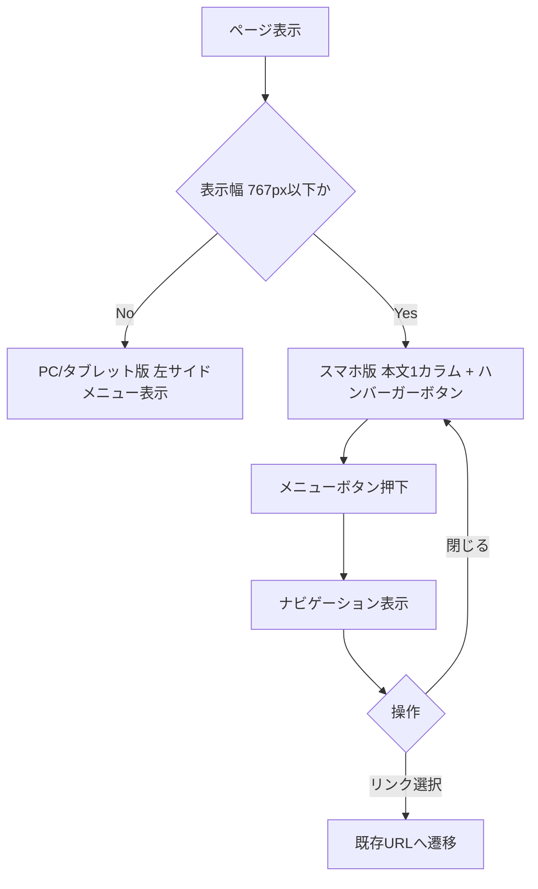

# v1.1 画面・画面遷移

## 画面一覧

本サイトは多数の静的HTMLページで構成されるが、共通レイアウトとして以下の2表示モードを持つ。

### UI-RWD-001 PC/タブレット表示

- `min-width: 768px` を対象とする。
- 現行の固定幅を基準としたPCレイアウトを維持する。
- 左サイドメニューを常時表示する。
- ハンバーガーボタンは表示しない。
- 本文、ヘッダー、フッター、広告等の配置は原則として現行踏襲とする。

### UI-RWD-002 スマートフォン表示

- `max-width: 767px` を対象とする。
- 本文を1カラム表示する。
- 左サイドメニューは通常表示しない。
- ヘッダー付近にハンバーガーボタンを表示する。
- ハンバーガーボタンを操作するとメニュー領域を開く。
- メニューを閉じる操作を提供する。
- 本文の横幅は端末幅内に収める。
- 表・コード・数式画像等、内容上横幅を必要とする要素は内容を欠落させず、必要に応じて要素単位の横スクロールを許容する。

## UI-NAV-001 ハンバーガーメニュー

### 初期表示
- 767px以下では閉じた状態を初期状態とする。
- 768px以上ではハンバーガーメニューを表示しない。

### 表示項目
- メニューボタン。
- 現行 `menu.html` に相当する主要ナビゲーション。
- 閉じるための操作手段。

### 操作
- メニューボタン押下: メニューを開く。
- 閉じる操作: メニューを閉じる。
- メニュー内リンク押下: 現行リンク先へ遷移する。

### アクセシビリティ
- ボタンとして操作可能であること。
- キーボード操作を阻害しないこと。
- 開閉状態を支援技術が認識できる属性を付与すること。

## 画面遷移

## 戻る・キャンセル

- メニュー開閉自体ではURLを変更しない。
- ブラウザの戻る操作は既存サイトと同じ挙動を維持する。

## 表示判定

- `max-width: 767px`: スマートフォン表示。ハンバーガーメニューを使用する。
- `min-width: 768px`: PC/タブレット表示。現行左サイドメニューを維持する。
