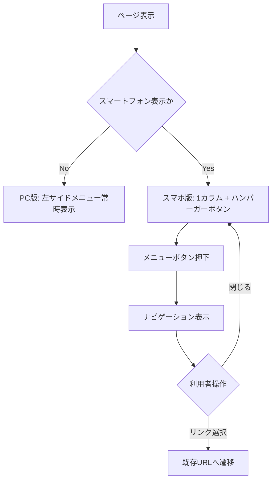

# v1.1 図・受け入れ条件

## 画面状態図

## 受け入れ条件

### ACC-001 PC表示維持
- PC幅で現行と同等の左サイドメニュー構成を維持する。
- ハンバーガーボタンを表示しない。
- 本文・ヘッダー・フッターが不必要に1カラム化されない。

### ACC-002 スマートフォン本文
- スマートフォン幅で本文を1カラム表示する。
- ページ全体に意図しない横スクロールが発生しない。
- 画像の縦横比を維持する。

### ACC-003 スマートフォンナビゲーション
- 左サイドメニューを通常表示しない。
- ハンバーガーボタンを表示する。
- ボタン押下でメニューを開閉できる。

### ACC-004 リンク互換
- ハンバーガーメニュー内のリンクは既存公開URLへ遷移する。
- 主要内部リンクに404を発生させない。

### ACC-005 回帰確認
- `index.html`、流体力学、有限要素法、物理、メッシュ等の代表ページでPC/スマートフォン表示を確認する。
- 表、画像、iframe、preを含むページを確認する。

### ACC-006 コンテンツ非改変
- 本工程では科学技術本文・数式画像の内容を変更しない。
- 数式のLaTeX化は別工程として扱う。

## 最終確認観点

- 文字化けがない。
- JavaScriptコンソールに新規エラーがない。
- PC/スマートフォン双方でナビゲーション可能。
- `release_1.0.0` との差分がv1.1対象範囲内である。
