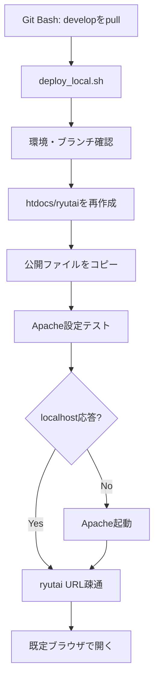

# v1.3 図・受け入れ条件

## 処理図

## BAT-LOCAL-ACC-001 受け入れ条件

- [ ] `deploy_local.sh` がリポジトリ直下に存在する。
- [ ] `develop` 以外では異常終了する。
- [ ] `C:\server\Apache24\htdocs\ryutai\index.html` が生成される。
- [ ] `.git/.github/.document/.rules` が `htdocs/ryutai` にコピーされない。
- [ ] Apache設定テストが成功する。
- [ ] `http://localhost/ryutai/` がHTTP成功する。
- [ ] ブラウザ起動を試行する。
- [ ] 本番FTPへ接続しない。
- [ ] 元サイトファイルのエンコードを変換しない。
- [ ] 再実行で同じ公開状態へ更新できる。
