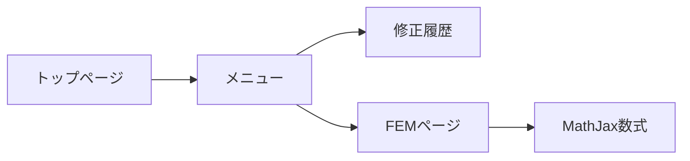

# v1.4 図・受け入れ条件

## 画面フロー

## 受け入れ条件
- ACC-UI-001: スマホで `.math-block` に水平スクロールバーが表示されない。
- ACC-UI-002: 長い数式がコンテナ幅内で自動改行され、式が途切れない。
- ACC-UI-003: ハンバーガーメニューを開き、マウスホイール/タッチで下部まで縦スクロールできる。
- ACC-UI-004: モバイルメニュー背景色に不連続なずれがなく、白背景が全高を覆う。
- ACC-UI-005: トップページのお知らせに2026-09-16の更新内容と修正履歴リンクが表示される。
- ACC-UI-006: footerから修正履歴リンクが消え、メニューの「お気に入りに追加」の直下に表示される。
- ACC-UI-007: PC版左メニューと既存URLが維持される。
- ACC-UI-008: PC1365px/スマホ390pxのスクリーンショットを取得して目視合格する。
