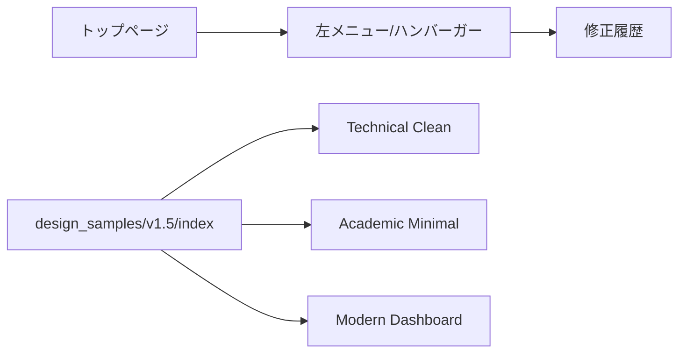

# v1.5 図・受け入れ条件

## 画面フロー

## v1.4から継承する受け入れ条件
- ACC-UI-001: スマホで `.math-block` に水平スクロールバーが表示されない。
- ACC-UI-002: 長い数式がコンテナ幅内で自動改行され、式が途切れない。
- ACC-UI-003: ハンバーガーメニューを開き、マウスホイール/タッチで下部まで縦スクロールできる。
- ACC-UI-004: モバイルメニュー背景色に不連続なずれがなく、白背景が全高を覆う。
- ACC-UI-005: トップページのお知らせに2026-09-16の更新内容と修正履歴リンクが表示される。
- ACC-UI-006: footerから修正履歴リンクが消え、メニューの「お気に入りに追加」の直下に表示される。
- ACC-UI-007: PC版左メニューと既存URLが維持される。
- ACC-UI-008: PC1365px/スマホ390pxのスクリーンショットを取得して目視合格する。

## v1.5 追加受け入れ条件
- ACC-UI-009: PC左メニューの表示文字が右端で切れない。
- ACC-UI-010: PCでメニューiframe自身に不要な縦スクロールバーが表示されない。
- ACC-UI-011: スマホではメニューiframeを最後まで縦スクロールできる。
- ACC-UI-012: ハンバーガーメニュー内の「広告」見出しが他のセクション見出しと同じ中央揃え・実効幅で表示される。
- ACC-UI-013: 修正履歴テーブルが `No. / 修正種類 / 対象 / 修正内容` の4列で表示され、画面上に管理ID列を表示しない。

## デザインサンプル受け入れ条件
- ACC-DESIGN-001: `design_samples/v1.5/index.html` から3案すべてへ遷移できる。
- ACC-DESIGN-002: A/B/C各案が同一の代表技術コンテンツを表示し、デザイン比較が可能である。
- ACC-DESIGN-003: 各案をPC1365px/スマホ390pxでスクリーンショット取得し、横スクロール・文字欠落・重なりがない。
- ACC-DESIGN-004: デザインサンプルの追加だけでは本体の既存ページデザインを変更しない。

## 本バージョンの確認停止条件
ACC-DESIGN-001〜004まで確認できた時点でユーザへサンプル完成を報告し、採用案の指示を待つ。