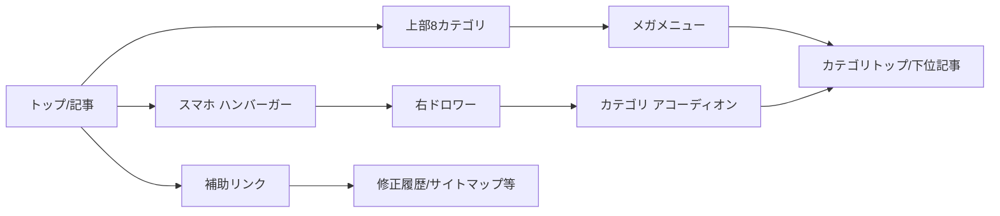

# v1.6 図・受け入れ条件

## 画面フロー

## v1.5までから継承する受け入れ条件
- ACC-UI-001: MathJax使用ページで `.math-block` に不要な水平スクロールバーを表示しない。
- ACC-UI-002: 長いMathJax式は内容を変更せず自動改行する。
- ACC-UI-005: トップページから更新情報・修正履歴へ到達できる。
- ACC-UI-013: 修正履歴テーブルが `No. / 修正種類 / 対象 / 修正内容` の4列で表示される。

## v1.6 正式デザイン受け入れ条件
- ACC-DESIGN-005: PC1365pxで左固定メニューが本文幅を占有せず、上部8カテゴリが1列で表示される。
- ACC-DESIGN-006: `物理 / 流体力学 / 有限要素法 / メッシュ / SIMPLE法 / 伝熱工学 / Fortran / その他` の8カテゴリが欠落しない。
- ACC-DESIGN-007: PCでカテゴリクリックにより対応メガパネルが開き、別カテゴリへ切替、同カテゴリ再クリック、外側クリック、Escapeで正しく閉じられる。
- ACC-DESIGN-008: 有限要素法などの深い階層が横方向の多段フライアウトではなく、1枚のメガパネル内で読める。
- ACC-DESIGN-009: スマホ390pxでハンバーガー→右ドロワー→カテゴリ→下位階層の順に操作でき、ドロワーを最後まで縦スクロールできる。
- ACC-DESIGN-010: 閉じたスマホドロワー内へTabフォーカスが移動しない。Escape/閉じる/オーバーレイ後のARIA状態が閉状態と一致する。
- ACC-DESIGN-011: D Monochrome Notesを基準に、白地・グレー罫線・低装飾・中央本文幅で表示され、PC1365px/タブレット768px/スマホ390pxで意図しない横スクロール、文字欠落、重なりがない。

## 数式保護受け入れ条件
- ACC-FORMULA-001: v1.6デザイン実装前後で通常ページの数式画像srcが意図せず変更されていない。
- ACC-FORMULA-002: v1.6デザイン実装コミットに通常ページのTeX式変更が混在していない。
- ACC-FORMULA-003: 再監査対象主要5ページは、監査完了前は通常ページで元数式画像を表示する。
- ACC-FORMULA-004: `*_mathjax_audit.html` は通常ナビからリンクされず、本番公開対象外として管理される。

## リンク・互換性受け入れ条件
- ACC-LINK-001: 既存カテゴリ・下位項目のhrefは `menu.html` の既存リンクを利用し、存在しないURLを生成しない。
- ACC-LINK-002: 代表リンクとして物理、流体力学、有限要素法、メッシュ、SIMPLE法、伝熱工学、Fortran、Appendix、コラム、修正履歴が正しいURLへ遷移する。
- ACC-LINK-003: 既存記事のURL自体を変更しない。

## JavaScript無効/失敗時
- ACC-FALLBACK-001: JavaScriptが無効または新ナビ初期化に失敗しても、本文DOMを削除せず閲覧可能である。
- ACC-FALLBACK-002: 新ナビ生成失敗が数式・画像・本文表示を停止させない。

## 本バージョンの完了条件
1. 仕様・設計・実装差分が一致する。
2. 上記受け入れ条件を確認する。
3. 数式内容の変更がないことを差分確認する。
4. ローカルApacheで代表ページを確認する。
5. ユーザが本体デザインを確認する。
6. 本番FTP反映は別途明示承認後に行う。
