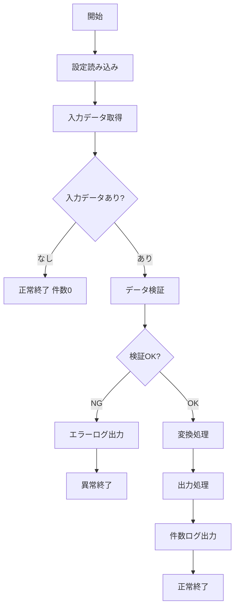
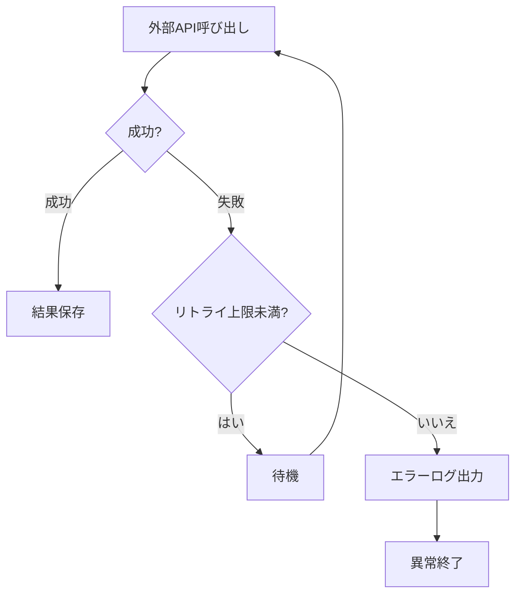

## 仕様書

  ユーザの開発指示と既存仕様を入力として、開発開始前に運用向けのシステム仕様を作成します。
  この工程で承認された仕様書を、以降の要件定義、設計、実装の基準とします。

### 出力フォルダとファイル

プロジェクト直下の `.document/v{n}.{m}/` フォルダに、次のファイルを作成する。

- `00_index.md`: バージョン、変更概要、仕様書変更一覧、仕様ID、項目別仕様書へのリンクを管理する。
- `01_差分仕様.md`: 前バージョンからの差分を管理する。
- `02_概要・対象範囲.md`: 概要、対象範囲、非対象範囲、用語定義を記載する。
- `03_実行仕様.md`: 実行方式、スケジュール、実行条件を記載する。
- `04_入出力仕様.md`: 入力仕様と出力仕様を記載する。
- `05_処理・データ仕様.md`: 処理仕様とデータ仕様を記載する。
- `06_外部連携・ファイル構成.md`: 外部連携とファイル構成を記載する。
- `07_セキュリティ・非機能.md`: セキュリティと非機能を記載する。
- `08_ログ・エラー・復旧.md`: ログ、エラー、例外、再実行、復旧を記載する。
- `09_図・受け入れ条件.md`: Mermaid図と受け入れ条件を記載する。
- `10_未決事項・変更履歴.md`: 未決事項、確認事項、変更履歴を記載する。

`.document` フォルダはGit管理対象とする。空フォルダとして保持する場合は `.document/.gitkeep` を作成する。

### 作成手順

1. バージョン、およびリビジョンを新規作成するか、現状を修正するかは、事前に確認を取ること。
2. `.document/v{n}.{m}/` フォルダを作成すること。
3. 前バージョンが存在する場合は、前バージョンの `99_仕様確認.md` を除く全仕様ファイルをコピーして作成し、今回差分を該当する項目別仕様書へ反映すること。白紙から再構成してはいけない。前バージョンの確認結果を新バージョンへ流用してはいけない。
4. `01_差分仕様.md` に前バージョンとの差分を記述すること。
5. `00_index.md` に全項目別仕様書への相対リンク、仕様IDと記載ファイルの対応、未決事項の有無を記載すること。
6. 項目別仕様書を全体として読んだときに、バッチ全体の現行仕様になるよう統合すること。
7. v1については、フォルダ構成と各ファイルの内容を作成前に提案し、ユーザ確認を取ること。

### 仕様書変更一覧

`00_index.md` に、今回の全仕様書の状態を次の形式で記載すること。

|仕様書|状態|変更概要|関連仕様ID|
|---|---|---|---|
|`03_実行仕様.md`|MOD|実行時刻を変更|BAT-EXEC-001|
|`08_ログ・エラー・復旧.md`|ADD|リトライ失敗時のログを追加|BAT-LOG-001|
|`04_入出力仕様.md`|KEEP|変更なし|-|

- `ADD`: 今回新規作成した仕様書
- `MOD`: 今回内容を変更した仕様書
- `DEL`: 今回廃止した仕様書
- `KEEP`: 前バージョンから変更していない仕様書
- `00_index.md` には、`00_index.md` 自身と `99_仕様確認.md` を除く全仕様書を記載すること。
- `01_差分仕様.md` には、状態が `ADD`、`MOD`、`DEL` の仕様書だけを記載すること。
- 状態と実際のファイル差分を一致させること。

### 禁止事項

- 仕様書をコードファイル別のフォルダや、`.document/v{n}.{m}/` 以外のバージョン別成果物フォルダへ作成してはいけない。
- 項目別仕様書を差分要約だけで構成してはいけない。
- **省略禁止:** 前バージョンに存在する章・文章・表・例・注意点を削除してはいけない。削除が必要な場合は、章自体は残し「廃止」「削除理由」を明記すること。

### 差分仕様書の記載ルール

`01_差分仕様.md` には、変更対象ごとに次の内容を記載すること。

- 仕様ID
- 変更区分: `[ADD]`、`[MOD]`、`[DEL]`、`[KEEP]`
- 変更前の仕様
- 変更後の仕様
- 変更理由
- 影響範囲
- 対応する項目別仕様書のファイル名、章または仕様ID

### 仕様IDと追跡性

- 処理、実行条件、入出力、データ、外部連携、エラー、再実行および受け入れ条件には、重複しない安定した仕様IDを付与すること。
- 既存仕様のIDは、内容を変更しても原則として維持すること。
- IDを変更または廃止する場合は、変更理由と旧IDとの対応を差分仕様書へ記載すること。
- 後続の要件定義書、設計書および最終確認から仕様IDを追跡できるようにすること。

### 未確定事項と設計事項

- 仕様作成中に判断できない事項は推測せず、「未確定」または「要確認」と記載すること。
- 手順2の仕様確認を完了するまでに、開発対象に関する未確定事項を解消すること。
- 実装方式、インデックス、テストファイル、具体的な内部配置などの設計事項は、仕様として決定済みの場合だけ確定事項として記載すること。
- 仕様作成時点で未決定の設計事項は「後続設計で決定」と明記し、仕様上の制約と混同しないこと。

### 仕様書の記載内容

項目別仕様書には、全体として原則以下の内容を記載すること。
該当しない項目は削除せず、「該当なし」と明記すること。  
未確定の項目は推測で埋めず、「未確定」または「要確認」と明記すること。

#### 1. 概要

- バッチ名
- 対象処理
- 目的
- 背景
- 実行主体
- 今回の変更概要

#### 2. 対象範囲・非対象範囲

- 今回対応する範囲
- 今回対応しない範囲
- 既存仕様として維持する範囲
- 手動運用で対応する範囲
- 将来対応予定がある場合の扱い

#### 3. 用語定義

- 業務用語
- データ項目名
- ファイル名
- 外部サービス名
- 略称

#### 4. 実行仕様

- 実行方式
- 手動実行/定期実行/イベント実行
- 実行コマンド
- 実行ユーザ
- 実行環境
- 実行タイミング
- スケジュール
- スケジュールのタイムゾーン
- 多重起動可否
- タイムアウト
- 停止方法
- 終了コード

#### 5. 入力仕様

- 入力元
- 入力ファイル
- 入力テーブル
- 入力API
- 入力パラメータ
- 必須/任意
- フォーマット
- 文字コード
- 改行コード
- タイムゾーン
- 入力データの前提条件
- 入力データが存在しない場合の扱い

#### 6. 出力仕様

- 出力先
- 出力ファイル
- 出力テーブル
- 出力API
- 通知
- 出力フォーマット
- 出力件数
- 上書き/追記
- 一時ファイル
- 完了後のファイル移動
- 出力データが0件の場合の扱い

#### 7. 処理仕様

- 処理全体の流れ
- 抽出条件
- 変換条件
- 集計条件
- 登録条件
- 更新条件
- 削除条件
- スキップ条件
- ソート順
- 重複判定
- 差分判定
- トランザクション範囲
- コミット単位
- ロールバック条件

#### 8. データ仕様

- 使用テーブル
- 主なカラム
- 主キー
- 外部キー
- インデックス
- 作成タイミング
- 更新タイミング
- 削除タイミング
- 論理削除/物理削除
- データ保持期間

#### 9. 外部連携仕様

外部連携がない場合は「該当なし」と明記すること。

- 連携先
- 連携方式
- 認証方式
- 送信データ
- 受信データ
- タイムアウト
- リトライ
- レート制限
- 失敗時の扱い
- 連携ログ

#### 10. フォルダ構成・ファイル構成

以下を明記すること。

- 配置先ディレクトリ
- 新規作成ファイル
- 変更対象ファイル
- 削除予定ファイル
- 設定ファイル
- 入力ファイル配置先
- 出力ファイル配置先
- 一時ファイル配置先
- ログファイル配置先
- テストファイル
- 生成物の配置先
- 参照してよい既存ファイル
- 参照してはいけない旧ファイル、廃止ファイル、バックアップファイル

同名または類似名のファイルが複数存在する場合は、正式な配置先、仕様書のバージョン、Git履歴、更新日時の順に確認し、正式な対象ファイルを特定すること。  
更新日時だけで対象ファイルを決定してはいけない。正式な対象ファイルを判断できない場合は、実装を開始せずユーザに確認すること。

#### 11. セキュリティ仕様

- 実行権限
- 認証情報の管理
- APIキー・トークンの管理
- 環境変数
- 設定ファイルの秘匿
- 入力ファイルのアクセス権
- 出力ファイルのアクセス権
- 一時ファイルのアクセス権
- 個人情報・秘密情報のマスク
- ログに出してはいけない情報
- 外部連携先の認証情報
- セキュリティ上の禁止事項

該当しない場合でも、以下のように明記すること。

```text
実行権限: 該当なし
認証情報: 取り扱いなし
APIキー・トークン: 取り扱いなし
秘密情報: 取り扱いなし
個人情報: 取り扱いなし
ログ出力制限: 秘密情報・個人情報をログに出力しない
```

#### 12. 非機能仕様

- 性能要件
- 想定処理件数
- 最大処理件数
- 処理時間
- メモリ使用量
- リトライ回数
- 可用性
- 保守性
- 再実行性
- 冪等性
- 運用上の制約

#### 13. ログ仕様

- 開始ログ
- 終了ログ
- 件数ログ
- スキップログ
- 警告ログ
- エラーログ
- ログレベル
- 出力項目
- 個人情報・秘密情報のマスク
- ログに出してはいけない情報
- 障害調査に必要な情報

#### 14. エラー・例外仕様

- 入力不正
- ファイルなし
- データなし
- DB接続エラー
- 外部APIエラー
- タイムアウト
- リトライ超過
- 異常終了
- 部分成功
- ロールバック
- 通知要否
- 復旧方法

#### 15. 再実行・復旧仕様

- 再実行可能条件
- 再実行時の挙動
- 重複登録防止
- 中断地点からの再開可否
- 手動復旧手順
- ロールバック手順
- 障害時の確認ポイント
- 再実行してはいけない条件

#### 16. Mermaid図

必要に応じて、Mermaid形式で図を記述すること。  
入力、処理、出力、エラー分岐、リトライ、外部連携を含む場合は、原則としてMermaid図を作成すること。

作成対象の例:

- 処理フロー図
- データフロー図
- 外部連携図
- リトライフロー図
- 異常終了時の復旧フロー図

例:



リトライを含む場合の例:



Mermaid図だけで仕様を完結させてはいけない。  
条件、項目、例外、エラー、ログについては文章または表でも記述すること。

#### 17. 受け入れ条件

- 正常終了条件
- 異常終了条件
- 出力確認条件
- ログ確認条件
- 再実行確認条件
- リトライ確認条件
- データ整合性確認条件
- 回帰確認条件

#### 18. 未決事項・確認事項

- 未確定の仕様
- ユーザ確認が必要な事項
- 実装前に決めるべき事項
- 判断できない理由
- 確認が必要な相手または資料

#### 19. 変更履歴

- バージョン
- 変更日
- 変更内容
- 変更理由
- 影響範囲
